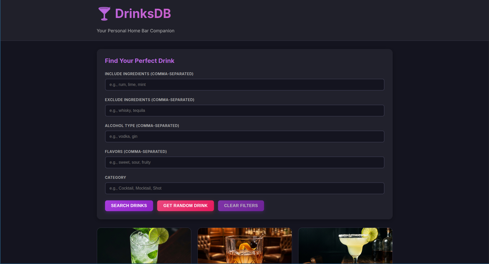
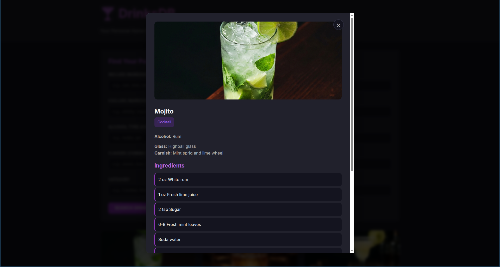

# DrinksDB 🍸

A full-stack home bar application for managing and discovering cocktail recipes. Search by ingredients, get random drink suggestions, and explore collection of cocktails.

## Screenshots

### Main Page

*Browse all drinks with advanced search filters and a responsive grid layout*

### Drink Detail

*View complete recipes with ingredients, instructions, and flavor profiles*

## Features

- 🔍 **Advanced Search** - Filter drinks by including/excluding ingredients
- 🎲 **Random Drink** - Get random suggestions with optional constraints
- 📱 **Fully Responsive** - Beautiful on mobile, tablet, and desktop
- 🐳 **Docker Ready** - One-command deployment
- ⚡ **Fast API** - Built with FastAPI

## Tech Stack

- **Backend**: Python 3.11+ with FastAPI
- **Frontend**: Vanilla JavaScript, HTML5, CSS3
- **Dependency Management**: UV
- **Containerization**: Docker & Docker Compose
- **Data Storage**: JSON file (easily replaceable with database)

## Quick Start

### Option 1: Docker (Recommended)

```bash
# Build and run with docker-compose
docker-compose up --build

# Access the app at http://localhost:8000
```

### Option 2: Local Development

```bash
# Install UV if you haven't already
curl -LsSf https://astral.sh/uv/install.sh | sh

# Install dependencies
uv pip install -r pyproject.toml

# Run the development server
uv run uvicorn backend.main:app --reload

# Access the app at http://localhost:8000
```

## Project Structure

```
DrinksDB/
├── backend/
│   ├── __init__.py
│   ├── main.py              # FastAPI application
│   ├── models.py            # Pydantic models
│   ├── data_handler.py      # JSON data operations
│   └── routers/
│       └── drinks.py        # API endpoints
├── frontend/
│   ├── index.html           # Main HTML
│   ├── style.css            # Styles
│   └── app.js               # Frontend logic
├── data/
│   └── drinks.json          # Drink recipes database
├── images/                  # Drink images (optional)
├── pyproject.toml           # Python dependencies
├── Dockerfile               # Docker configuration
└── docker-compose.yml       # Docker Compose setup
```

## API Endpoints

- `GET /api/drinks/` - Get all drinks
- `GET /api/drinks/{id}` - Get specific drink by ID
- `GET /api/drinks/search` - Search drinks with filters
  - Query params: `include_ingredients`, `exclude_ingredients`, `alcohol_types`, `flavors`, `category`
- `GET /api/drinks/random` - Get random drink (supports same filters)
- `GET /api/health` - Health check

## Adding Your Own Drinks

Edit `data/drinks.json` to add new drinks. Each drink should follow this structure:

```json
{
  "id": "unique-id",
  "name": "Drink Name",
  "image": "/images/drink.jpg",
  "category": "Cocktail",
  "alcohol_type": ["Rum", "Vodka"],
  "ingredients": [
    "2 oz Ingredient 1",
    "1 oz Ingredient 2"
  ],
  "instructions": [
    "Step 1",
    "Step 2"
  ],
  "glass_type": "Highball glass",
  "flavors": ["Sweet", "Fruity"],
  "garnish": "Lime wheel"
}
```

## Adding Images

1. Place drink images in the `images/` directory
2. Reference them in `drinks.json` as `/images/your-image.jpg`
3. The app will automatically serve them


## Development

The app supports hot-reloading in development:

```bash
# Backend with auto-reload
uv run uvicorn backend.main:app --reload

# Or with docker-compose (volumes are mounted)
docker-compose up
```

## Future plans
1. Probably worth moving drinks to database
2. Host it somewhere?
3. Add easier way to add new recipes (maybe a form/api?)